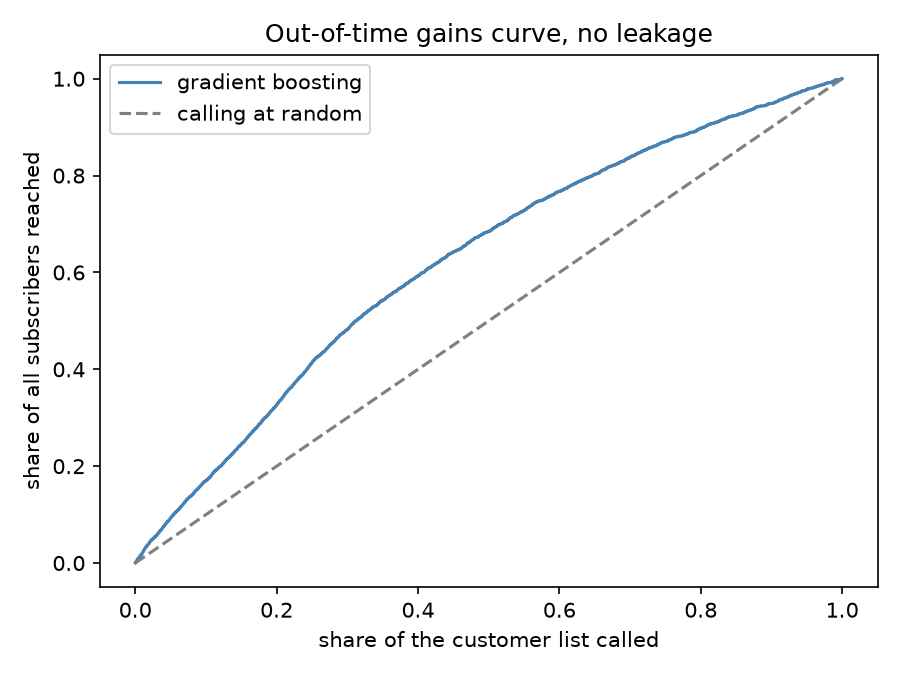

# Term deposit subscription — modelling pipeline

Predicting which bank customers will subscribe to a term deposit, from direct marketing
campaign data (45,211 contacts, May 2008 – Nov 2010).

- **Part A** — the pipeline: [`src/term_deposit/`](src/term_deposit/), with the
  exploration that shaped it in [`notebooks/01_eda.ipynb`](notebooks/01_eda.ipynb).
- **Part B** — [`INSIGHTS.md`](INSIGHTS.md): what this model assumes, where it breaks,
  and the experiment that would prove a better approach.
- The reasoning recorded before and during implementation is in [`PLAN.md`](PLAN.md).

## Setup

Requires [uv](https://docs.astral.sh/uv/) and Python 3.12+.

```bash
make install    # uv sync — creates .venv from the committed lock file
make train      # reproduces every number quoted in this repo (~55s)
make test       # 47 tests
make lint       # ruff
```

`make train` reads `data/dataset.csv` and writes `artifacts/results.csv`,
`artifacts/results.md` and `artifacts/gains_curve.png`. It is seeded, so a second run
reproduces identical numbers.

## Results

Full grid in [`artifacts/results.md`](artifacts/results.md). Gradient boosting, held-out
data:

| evaluation | ROC-AUC | PR-AUC | precision@10% |
| --- | --- | --- | --- |
| random split, with `duration` | 0.934 | 0.632 | 0.634 |
| random split, no `duration` | 0.803 | 0.465 | 0.522 |
| **out-of-time split, no `duration`** | **0.679** | **0.473** | **0.527** |

**The last row is the one I would stand behind.** The first is what this dataset usually
produces in public notebooks, and roughly half that gap is target leakage while the other
half is an over-optimistic split. The 0.803 figure matches the range published for honest
random-CV treatments of this data, which is a useful sign the pipeline is not doing
anything exotic.



Calling the top 30% of the ranked list reaches 48% of all subscribers; the top 10%
reaches 17%.

## Three decisions that shaped the pipeline

**`duration` is excluded as target leakage.** It is the length of the call whose outcome
we are predicting — unknown before the call, and redundant after it. On its own it
reaches 0.808 ROC-AUC. The UCI documentation says it "should be discarded if the
intention is to have a realistic predictive model". It remains reachable behind an
explicit flag purely so the cost of excluding it can be measured rather than assumed.

**The evaluation is out of time.** The file has no year column, but the rows are
chronological, so counting backwards steps in the month sequence recovers the campaign
year. The reconstructed span (May 2008 – Nov 2010) matches the dataset's published
description, which is the check on the method. This matters because the data drifts hard:
the training period converts at 6.7% and the test period at 31.1%.

**`pdays = -1` is a sentinel, not a number.** It means "never previously contacted" and
covers 81.7% of rows, so scaling it alongside real day-counts would place "never" just
below "yesterday". It becomes an explicit indicator plus a constant fill outside the
observed range. It is also collinear with `poutcome = "unknown"` — they disagree on 5 of
45,211 rows — so one-hot encoding both would hand the model the same fact twice.

## Layout

```
src/term_deposit/
  data.py           loading, year recovery from month rollovers
  splits.py         out-of-time and random splits
  preprocessing.py  ColumnTransformer — leakage quarantine, sentinel handling
  models.py         prior baseline, logistic regression, gradient boosting
  metrics.py        precision@k, lift, PR-AUC, calibration, gains curve
  experiment.py     the evaluation grid
  power.py          sample sizing for the experiment proposed in INSIGHTS.md
  cli.py            `make train`
tests/              47 tests over the load-bearing logic
notebooks/01_eda.ipynb
artifacts/          committed outputs, so the numbers are checkable without running
```

## Deliberate scope decisions

Three hours, so some things are consciously left out rather than overlooked:

- **Tests cover the load-bearing logic, not everything** — year recovery, sentinel
  handling, split leakage, metric tie-breaking, the leakage flag surviving end to end. In
  production every preprocessing function would be unit-tested and the pipeline would
  have an end-to-end regression test pinning the reported numbers.
- **No hyperparameter tuning.** Library defaults throughout. The exercise scopes this out,
  and it is the change least likely to affect the business outcome.
- **No `class_weight="balanced"`**, despite the 11.7% positive rate. Reweighting barely
  moves a ranking while inflating predicted probabilities, and calibration is already the
  weakest part of the out-of-time result. The campaign decision is "rank, then call down
  the list until capacity runs out", not "threshold at 0.5".
- **No serving or infrastructure** — out of scope by instruction, though the pipeline runs
  end to end from raw data with one command.
- **No macroeconomic features**, because the dataset has none. This is a material gap, not
  a small one: published work on a richer version of this dataset found the Euribor rate
  to be the strongest single driver. Discussed in `INSIGHTS.md` rather than ignored.

## Tool Stack

**Development:** VS Code · Python 3.13 · [uv](https://docs.astral.sh/uv/) for
environment and locking · ruff · pytest.

**Libraries:** pandas · scikit-learn · scipy · matplotlib · nbclient (to execute the EDA
notebook reproducibly rather than by hand).

**AI:** [Claude Code](https://claude.com/claude-code) (Opus 5) in the VS Code extension,
used throughout. Full transcripts are in [`AI_TRANSCRIPTS/`](AI_TRANSCRIPTS/).

Where it genuinely helped:

- **Prior-art research**, run as two parallel agents before any code. This is what turned
  up that the widely-cited AUC 0.80 / ALIFT 0.70 benchmark belongs to a *different,
  richer* version of this dataset (Moro, Cortez & Rita 2014) rather than the file here
  (Moro, Laureano & Cortez 2011). I would otherwise have quoted the wrong benchmark.
- **Drafting and refactoring** — most of the module and test scaffolding.
- **Catching my own mistakes.** Two bugs surfaced from tests it wrote: `precision@k` was
  breaking ties by row order, which would have scored the constant-prediction baseline
  against the dataset's date ordering; and the `pdays` median imputer silently dropped the
  column for early training windows where every value is the sentinel.

Course corrections during the session — I have kept these attributed accurately, since
the brief is asking how the work was actually produced:

- **`class_weight="balanced"`** was written into `PLAN.md` as a reflex for the imbalance
  and then removed before implementation, for the calibration reason above. That was the
  agent revising its own plan, not me catching it.
- **A test asserting that shuffled rows would be rejected** by the year recovery. The
  test failed, and the test was wrong rather than the code: a backwards month step is
  *defined* as a year boundary, so out-of-order rows cannot be detected at all. It now
  documents the limitation instead of pretending it does not exist.
- **Scope**, which needed steering from me throughout. Left alone the agent proposes more
  abstraction, more model variants and more configurability than three hours or the brief
  justifies. The committed `CLAUDE.md` is the standing instruction that keeps it in check.

The decisions that were mine rather than the agent's: research the prior art before
writing any code, commit at every step rather than in batches, keep the brief PDF out of
a public repository, and lead Part B with the causal argument rather than with model
improvements.

## Data

`data/dataset.csv` and `data/data-dictionary.txt` as provided. This is the UCI *Bank
Marketing* dataset (`bank-full.csv`); the exercise brief PDF is deliberately not committed
to this public repository.
